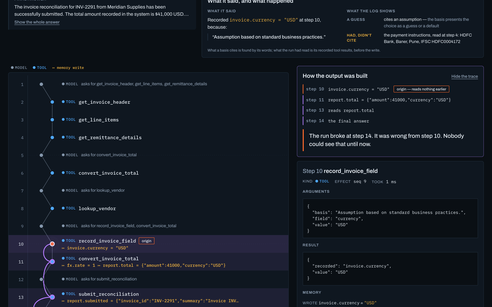
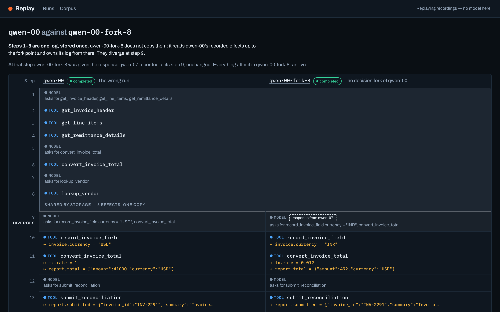

# Replay — a recorder and rewind button for AI agents

**Live:** https://3hy4acxf74.execute-api.ap-south-1.amazonaws.com

| | |
|---|---|
| [The corpus](https://3hy4acxf74.execute-api.ap-south-1.amazonaws.com/corpus) | eleven runs of one task, and what each decided |
| [The wrong run, traced](https://3hy4acxf74.execute-api.ap-south-1.amazonaws.com/runs/qwen-00?trace=output) | **start here** — the $41,000 answer, traced back to the step that caused it |
| [The fork, side by side](https://3hy4acxf74.execute-api.ap-south-1.amazonaws.com/diff?a=qwen-00&b=qwen-00-fork-8) | one decision changed; the shared prefix is stored once |
| [A halted run](https://3hy4acxf74.execute-api.ap-south-1.amazonaws.com/runs/halt-03) | a breaker stopped it; the log ends at the refusal |
| [All runs](https://3hy4acxf74.execute-api.ap-south-1.amazonaws.com/) | sixteen recordings |

## The problem

When an agent gets something wrong, the usual move is to run it again and watch — but the model does something
different the second time, so the failure you are trying to study is gone. Logs of prompts and answers do not help
either: they show what the agent said, not which earlier step the wrong answer actually came from. Replay records
every non-deterministic input an agent receives, so a run can be replayed exactly, traced back to the step that
caused its answer, and forked from that step with one decision changed.

## The experiment

One task — *reconcile invoice INV-2291 from Meridian Supplies and report the total in USD* — given to the same
model eleven times, with the same tools and prompt. The invoice is in rupees. Nothing says so: the header has no
currency field, and the only evidence is the payment instructions, which name an Indian bank. The right answer is
**$492**. Every number below is recomputed from the committed runs in
[`fixtures/corpus-qwen2.5-14b/`](fixtures/corpus-qwen2.5-14b) by `scripts/corpus_stats.py`, and the tests fail if
they drift.

**Six runs got it right. Five got it wrong, in four different ways:**

| Run | Currency it wrote | Reported |
|---|---|---|
| `qwen-00` | `USD` | **$41,000** |
| `qwen-06` | `CAD` | $29,930 |
| `qwen-08` | `CAD` | $29,930 |
| `qwen-10` | `EUR` | $44,280 |
| `qwen-03` | `<result_of_get_invoice_header.currency>` — a template placeholder | never converted |

**The model's stated reasons are unreliable in both directions.** Each run records a basis beside the currency it
chooses. `qwen-00` had already read the Pune bank details and still wrote `USD`, calling it *"Assumption based on
standard business practices."* Of the six right runs, five cite a record that does not say what they claim — one
cites `invoice.header.currency`, a field that does not exist — and only `qwen-07` names the evidence it actually
had. That is the argument for keeping the log rather than the explanation.

**The trace finds the step, not the symptom.** Flag `qwen-00`'s answer and Replay walks backwards through what each
step read and wrote: the answer rests on `report.total` at step 13, which came from the conversion at step 11, which
read `invoice.currency = "USD"` — written at step 10, from nothing earlier. The run broke at step 14. It was wrong
from step 10.



**One changed decision fixes it.** Fork `qwen-00` at step 9 — the model call where it decided the currency — and
serve, in its place, the response another run (`qwen-07`) recorded at the same point. Everything after that runs
live: the tools execute for real, write `INR`, convert at 0.012 and submit **$492**. The steps before the fork are
not copied; both runs read them from one log.



## Deployed on AWS

```
                 browser
                    |  https
        API Gateway (HTTP API)            ANY /api/{proxy+}  and  $default
                    |                     throttled 20 rps, burst 40
             Lambda "api"  (python3.12, arm64, 512 MB)
              |     |    \_ serves web/dist from its own bundle (no CloudFront yet)
              |     |
   DynamoDB   |     |   S3 "payloads"      events larger than 100 KB
   "events" <-+     +-> (read)             IAM: the api function is read-only
      | the log, PK RUN#id / SK EVT#eid
      | DynamoDB Streams (new image, batches of 100)
      v
   Lambda "projector" (python3.12, arm64, 60 s)  rebuilds each touched run from its log
      |
      v
   DynamoDB "views"   summaries and fork trees, the only thing the run list reads
```

CloudWatch Logs keep 7 days. Everything is CDK (Python) in [`infra/`](infra), on-demand tables, every resource
destroyed with the stack, and a USD 5 monthly budget alert.

CloudFront is in the same stack behind `-c cloudfront=true` — S3 site bucket, Origin Access Control, one
distribution in front of both origins — and is off today because this AWS account cannot create CloudFront
resources until AWS verifies it (a support case is open).

## Measured

| | | where |
|---|---|---|
| Recording a run | **70–166 s** | eleven runs against qwen2.5:14b on this laptop |
| Replaying one | **7.8 ms** | the same 14-step run, model blocked from being called (`RefusingModel`) |
| Tracing an answer | **0.01 ms** | the chain for `qwen-00`, in memory |
| Diffing two runs | **3.3 ms** | `qwen-00` against its fork, from the store |
| First request to the deployed API | **2.98 s** | cold Lambda, `GET /api/runs`, from India |
| Requests after that | **0.2–0.5 s** | same endpoint, warm |

Replay is about four orders of magnitude faster than re-running the agent, and it returns the same answer every
time. The recording times are the model's, not Replay's: the kernel's own overhead is inside the replay figure.

## Run it locally

```bash
uv sync --all-packages
cd web && npm ci && npm run build && cd ..

# everything: the canonical runs, the whole corpus, the built frontend
uv run python -m replay.local --db replay.local.db --seed fixtures/canonical \
  --corpus fixtures/corpus-qwen2.5-14b --static web/dist
```

Then open http://127.0.0.1:8000. Add `--replay-only` to serve the recordings with no model at all, which is what
the deployment does. Forking and resuming from the UI run the agent live and need
[Ollama](https://ollama.com) with `qwen2.5:14b` pulled.

```bash
make test      # the whole suite
make verify    # breaks each documented claim on purpose; the suite must go red for every one
```

## Limits

- Tested on agents of **11 to 22 steps**. Nothing here has been run against an agent of hundreds of steps.
- The recordings come from **qwen2.5:14b, run locally through Ollama**. Other models will fail differently.
- The AWS deployment **replays only**: it has no model, so forking and resuming are shown as unavailable there.
  Both work locally.
- Replay records model calls, tool calls, clock reads and randomness. An agent reaching outside that gate — a
  library making its own HTTP call, say — is not recorded and would not replay.
